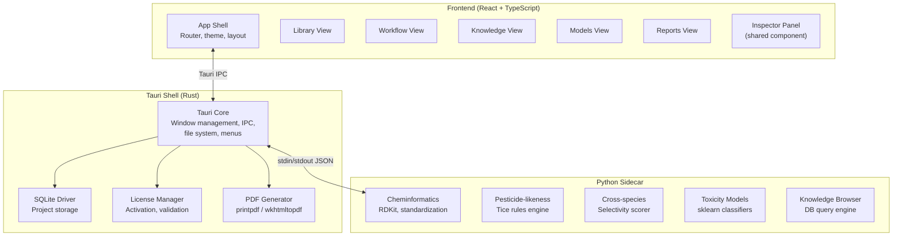

# Edeon Desktop — Implementation Plan

## What We're Building

**Edeon Desktop** is a local-first agrochemical lead optimization platform targeting commercial agchem buyers (Syngenta, BASF, FMC, etc.). The killer feature is **cross-species selectivity analysis** — something no existing tool does well. The app processes compound libraries through multi-stage analytical workflows, with results displayed in a dense, professional UI inspired by tools like Maestro and KNIME.

The SVG mockup defines the visual language: earthy greens, clean typography, a three-panel layout (sidebar · main · inspector), and a pipeline-forward workflow view.

---

## User Review Required

> [!IMPORTANT]
> **Technology stack choices below need your confirmation** before I start writing code. Particularly: Tauri vs Electron, React vs Svelte for the frontend, and how you plan to handle the Python cheminformatics backend.

> [!WARNING]
> **This is a large project.** The MVP spec lists 10 Tier 1 features. I propose building them in 6 incremental phases, each producing a runnable application. Phase 1 alone is ~2-3 weeks of focused work. Full MVP is a multi-month effort.

---

## Open Questions

> [!IMPORTANT]
> **1. Do you have existing backend code?** The MVP.txt mentions Phase 1-2 web platform work that delivers pesticide-likeness, cross-species selectivity, toxicity models, etc. Is there an existing Python/Rust backend I should integrate with, or are we starting from scratch?

> [!IMPORTANT]
> **2. Tauri version?** Tauri v2 is stable and supports sidecars (for bundling a Python runtime). Should I target Tauri v2?

> [!IMPORTANT]
> **3. Frontend framework preference?** I recommend **React + TypeScript** for ecosystem maturity and component libraries (especially for the data table). Alternatives: Svelte (lighter, faster) or SolidJS. What's your preference?

> [!IMPORTANT]
> **4. Python sidecar vs embedded?** The cheminformatics stack (RDKit, scikit-learn, etc.) essentially requires Python. Two approaches:
> - **Sidecar**: Bundle a Python runtime + scripts alongside Tauri. Tauri v2 has first-class sidecar support. Simpler to develop.
> - **PyO3/Rust bindings**: Compile Python-dependent logic into Rust. Harder to build, cleaner to ship.
> 
> I recommend sidecar for MVP speed.

> [!IMPORTANT]
> **5. Target platforms?** Windows only for MVP, or also macOS/Linux?

> [!IMPORTANT]  
> **6. Do you already have the ML models and databases** (PPDB, ECOTOX, etc.) bundled, or do those need to be built/acquired?

---

## Proposed Architecture



### Why This Stack

| Layer | Choice | Rationale |
|-------|--------|-----------|
| Desktop shell | **Tauri v2** | Small binary (~10MB vs Electron's 150MB+), Rust performance, native menus, sidecar support, auto-updater |
| Frontend | **React 19 + TypeScript** | Mature ecosystem, excellent table libraries (TanStack Table), large hiring pool for future team |
| Styling | **Vanilla CSS** with CSS custom properties | Full control over the dense scientific UI; design tokens from the SVG mockup |
| State management | **Zustand** | Lightweight, no boilerplate, works well with Tauri IPC |
| Data table | **TanStack Table v8** | Headless, virtualized, sortable, filterable — exactly what the results table needs |
| Cheminformatics | **Python 3.11 + RDKit** | Industry standard; no viable Rust/JS alternative for SMILES parsing, property calculation |
| Database | **SQLite** (via `rusqlite`) | Embedded, file-based projects, zero config |
| PDF export | **Rust `printpdf`** or **Typst** | Professional output without external deps |

---

## Project Structure

```
Edeon/
├── src-tauri/                    # Rust backend (Tauri)
│   ├── src/
│   │   ├── main.rs               # Entry point, app setup
│   │   ├── commands/             # Tauri IPC command handlers
│   │   │   ├── project.rs        # Project CRUD, compound import
│   │   │   ├── workflow.rs       # Workflow execution, status
│   │   │   ├── knowledge.rs      # Database queries
│   │   │   ├── license.rs        # License management
│   │   │   └── export.rs         # PDF generation
│   │   ├── db/                   # SQLite schema, migrations
│   │   │   ├── schema.rs
│   │   │   └── migrations/
│   │   ├── sidecar/              # Python sidecar management
│   │   │   └── manager.rs
│   │   └── models/               # Rust data types
│   │       ├── compound.rs
│   │       ├── workflow.rs
│   │       └── project.rs
│   ├── Cargo.toml
│   └── tauri.conf.json
│
├── src/                          # React frontend
│   ├── main.tsx                  # Entry point
│   ├── App.tsx                   # Root: layout + router
│   ├── styles/
│   │   ├── tokens.css            # Design tokens from SVG
│   │   ├── global.css            # Reset, typography, base
│   │   ├── layout.css            # Three-panel layout
│   │   └── components.css        # Component styles
│   ├── components/
│   │   ├── layout/
│   │   │   ├── Header.tsx        # Top bar: logo, breadcrumb, status, controls
│   │   │   ├── Sidebar.tsx       # Left: projects, views, recent workflows
│   │   │   ├── Inspector.tsx     # Right: compound detail, actions
│   │   │   └── StatusBar.tsx     # Bottom: jobs, memory, license
│   │   ├── workflow/
│   │   │   ├── WorkflowHeader.tsx
│   │   │   ├── Pipeline.tsx      # Stage boxes with connectors
│   │   │   ├── PipelineStage.tsx  # Individual stage (done/running/waiting)
│   │   │   └── ResultsTable.tsx  # TanStack Table with risk badges
│   │   ├── library/
│   │   │   ├── CompoundTable.tsx
│   │   │   └── ImportDialog.tsx
│   │   ├── knowledge/
│   │   │   ├── SearchBar.tsx
│   │   │   └── ResultCard.tsx
│   │   ├── shared/
│   │   │   ├── RiskBadge.tsx     # Low/Med/High colored badges
│   │   │   ├── ProgressBar.tsx
│   │   │   ├── SelectivityCards.tsx  # 4-organism grid
│   │   │   └── StructureViewer.tsx   # 2D molecule rendering
│   │   └── modals/
│   │       ├── LicenseDialog.tsx
│   │       └── ProjectDialog.tsx
│   ├── views/
│   │   ├── LibraryView.tsx
│   │   ├── WorkflowView.tsx
│   │   ├── KnowledgeView.tsx
│   │   ├── ModelsView.tsx
│   │   └── ReportsView.tsx
│   ├── store/
│   │   ├── projectStore.ts       # Active project, compound list
│   │   ├── workflowStore.ts      # Running workflow state, stages
│   │   └── uiStore.ts            # Selected view, inspector state
│   ├── hooks/
│   │   ├── useTauriCommand.ts    # IPC wrapper
│   │   └── useWorkflowStream.ts  # Progressive results listener
│   └── types/
│       ├── compound.ts
│       ├── workflow.ts
│       └── project.ts
│
├── python/                       # Python sidecar
│   ├── edeon_engine/
│   │   ├── __main__.py           # JSON-RPC stdin/stdout server
│   │   ├── standardize.py        # SMILES canonicalization, salt stripping
│   │   ├── tice_rules.py         # Pesticide-likeness (herb/insect/fungi)
│   │   ├── selectivity.py        # Cross-species selectivity scoring
│   │   ├── toxicity.py           # ML toxicity classifiers
│   │   ├── knowledge.py          # Multi-database search
│   │   ├── properties.py         # MW, LogP, TPSA, H-bond donors
│   │   └── models/               # Pre-trained sklearn models
│   │       ├── bee_toxicity.pkl
│   │       ├── fish_toxicity.pkl
│   │       ├── bird_toxicity.pkl
│   │       └── mammal_toxicity.pkl
│   ├── requirements.txt
│   └── pyproject.toml
│
├── data/                         # Bundled databases
│   ├── ppdb.sqlite               # Pesticide Properties DataBase
│   ├── ecotox.sqlite             # EPA ECOTOX
│   ├── openfoodtox.sqlite        # EFSA OpenFoodTox
│   ├── eu_pesticides.sqlite      # EU Pesticides Database
│   ├── orthologs.sqlite          # Pre-computed ortholog data
│   └── resistance.sqlite         # Resistance mutation database
│
├── package.json
├── tsconfig.json
├── vite.config.ts
└── index.html
```

---

## Design System (from SVG Mockup)

Extracted directly from the SVG:

```css
/* tokens.css */
:root {
  /* Brand greens — primary palette */
  --color-brand-900: #173404;
  --color-brand-700: #2d5016;
  --color-brand-600: #3b6d11;
  --color-brand-100: #eaf3de;
  --color-brand-50:  #c0dd97;

  /* Blues — running/active state */
  --color-blue-700: #0c447c;
  --color-blue-500: #378add;
  --color-blue-100: #e6f1fb;
  --color-blue-50:  #cce0f5;

  /* Amber — medium risk / warnings */
  --color-amber-700: #854f0b;
  --color-amber-100: #faeeda;
  --color-amber-50:  #fac775;

  /* Red — high risk */
  --color-red-700: #993c1d;
  --color-red-500: #791f1f;
  --color-red-100: #fceae5;
  --color-red-50:  #f7c1c1;

  /* Neutrals */
  --color-bg:       #fafaf7;
  --color-surface:  #ffffff;
  --color-sidebar:  #f5f5f0;
  --color-border:   #e5e5e0;
  --color-text-900: #1a1a1a;
  --color-text-600: #5a5a5a;
  --color-text-400: #888888;

  /* Layout dimensions from SVG (1280×880) */
  --sidebar-width:   220px;
  --inspector-width: 280px;
  --header-height:   50px;
  --statusbar-height: 30px;

  /* Typography */
  --font-family: -apple-system, BlinkMacSystemFont, 'Segoe UI', Roboto, sans-serif;
  --font-mono: 'Courier New', monospace;
}
```

### Risk Badge Variants

| Level | Background | Text | Border |
|-------|-----------|------|--------|
| Low / High (good) | `#c0dd97` | `#173404` | — |
| Medium | `#fac775` | `#854f0b` | — |
| High (bad) | `#f7c1c1` | `#791f1f` | — |

### Pipeline Stage States

| State | Background | Border | Icon |
|-------|-----------|--------|------|
| Complete | `#eaf3de` | `#3b6d11` | Green circle + ✓ |
| Running | `#e6f1fb` | `#378add` | Blue circle + ● + progress bar |
| Waiting | `#ffffff` | `#e5e5e0` | Gray hollow circle ○ |

---

## Proposed Changes — Phased Build

### Phase 1: Desktop Shell & Layout (Foundation)

The skeleton that looks like the SVG mockup — all five views navigable, no real data yet.

#### [NEW] Tauri project scaffold
- `npx create-tauri-app` with React + TypeScript + Vite template
- Configure `tauri.conf.json`: window title "Edeon Desktop", 1280×880 default size, custom icon
- Set up window chrome: frameless with custom titlebar, or native with menu bar

#### [NEW] Design system — `src/styles/tokens.css`, `global.css`, `layout.css`
- All CSS custom properties from the SVG
- Three-panel layout: sidebar (220px fixed) · main (flexible) · inspector (280px, collapsible)
- Font import: system font stack matching the SVG

#### [NEW] Layout components
- **Header.tsx**: Logo "Edeon Desktop", project breadcrumb, workflow status pill, progress bar, pause/settings/save buttons, user avatar
- **Sidebar.tsx**: PROJECTS list (with active highlight + compound count), VIEWS navigation (Library/Workflows/Knowledge/Models/Reports with active indicator + blue badge), RECENT WORKFLOWS list, Settings/Help links
- **Inspector.tsx**: Generic panel that accepts children; SELECTED COMPOUND header, structure thumbnail placeholder, key properties grid, selectivity cards (2×2 grid), resistance metrics, action buttons
- **StatusBar.tsx**: Active jobs indicator (green dot + text), queue count, memory usage, models loaded, license status

#### [NEW] View routing
- `WorkflowView.tsx`: Pipeline visualization + results table (static/mock data matching SVG)
- `LibraryView.tsx`, `KnowledgeView.tsx`, `ModelsView.tsx`, `ReportsView.tsx`: Placeholder layouts
- Sidebar click switches views; no URL routing needed (desktop app)

**Deliverable**: A running Tauri app that looks exactly like the SVG mockup with hardcoded sample data.

---

### Phase 2: Project System & Data Layer

Real persistence — users can create projects, import compounds, close and reopen.

#### [NEW] SQLite schema — `src-tauri/src/db/`
```sql
-- Core tables
CREATE TABLE projects (
    id TEXT PRIMARY KEY,
    name TEXT NOT NULL,
    created_at TEXT,
    updated_at TEXT,
    compound_count INTEGER DEFAULT 0
);

CREATE TABLE compounds (
    id TEXT PRIMARY KEY,
    project_id TEXT REFERENCES projects(id),
    name TEXT,
    smiles TEXT NOT NULL,
    properties JSON,  -- MW, LogP, TPSA, etc.
    created_at TEXT
);

CREATE TABLE workflows (
    id TEXT PRIMARY KEY,
    project_id TEXT REFERENCES projects(id),
    name TEXT,
    template TEXT,  -- workflow type identifier
    status TEXT,    -- pending/running/complete/failed
    config JSON,
    started_at TEXT,
    completed_at TEXT
);

CREATE TABLE workflow_results (
    id TEXT PRIMARY KEY,
    workflow_id TEXT REFERENCES workflows(id),
    compound_id TEXT REFERENCES compounds(id),
    stage TEXT,
    results JSON,
    score REAL
);
```

#### [NEW] Tauri commands — `src-tauri/src/commands/project.rs`
- `create_project(name)`, `list_projects()`, `open_project(id)`, `delete_project(id)`
- `import_compounds(project_id, file_path, format)` — CSV, SDF, MOL file parsing
- `list_compounds(project_id, page, sort, filter)` — paginated, sorted

#### [MODIFY] Frontend stores + views
- `projectStore.ts`: Zustand store synced with Tauri IPC
- Sidebar shows real project list from SQLite
- Library view shows real compound table with pagination

**Deliverable**: Projects persist between app restarts. Users can create projects and import CSV compound files.

---

### Phase 3: Python Sidecar & Cheminformatics

The computational engine that makes Edeon actually useful.

#### [NEW] Python engine — `python/edeon_engine/`
- `__main__.py`: JSON-RPC server over stdin/stdout. Receives commands like `{"method": "standardize", "params": {"smiles": [...]}}`, returns results progressively
- `standardize.py`: RDKit-based SMILES canonicalization, salt stripping, tautomer standardization
- `properties.py`: MW, LogP (Crippen), TPSA, H-bond donors/acceptors, rotatable bonds
- `tice_rules.py`: Tice rule sets for herbicides, insecticides, fungicides — pass/fail with violation details

#### [NEW] Sidecar manager — `src-tauri/src/sidecar/manager.rs`
- Spawn Python process on app start
- JSON-RPC communication over stdin/stdout
- Health check, restart on crash
- Graceful shutdown

#### [NEW] Tauri workflow commands — `src-tauri/src/commands/workflow.rs`
- `start_workflow(project_id, template, config)`: Launches a multi-stage pipeline
- `get_workflow_status(workflow_id)`: Returns stage progress
- Event emitter: `workflow://progress` events pushed to frontend as stages complete

#### [MODIFY] Frontend workflow view
- Pipeline stages update in real time via Tauri event listener
- Results table populates progressively as compounds pass through stages
- Inspector shows real compound properties

**Deliverable**: The "Lead Optimization Pre-Screen" workflow runs end-to-end: standardize → pesticide-likeness → property calculation. Results appear progressively in the table.

---

### Phase 4: Core Science Features

The differentiators that make Edeon worth €3000/year.

#### [NEW] Cross-species selectivity — `python/edeon_engine/selectivity.py`
- UniProt ID / FASTA input for target sequence
- Ortholog retrieval from bundled `orthologs.sqlite`
- Binding site conservation analysis
- Per-compound selectivity score (target/non-target ratio)
- Output: selectivity profile across pest, crop, pollinator, mammal

#### [NEW] Toxicity prediction — `python/edeon_engine/toxicity.py`
- Pre-trained classifiers for bee, fish, bird, mammal toxicity
- Low/Medium/High risk bins with confidence
- Applicability domain checking (Tanimoto distance to training set)
- Comparison against regulatory thresholds (EPA, EFSA)

#### [NEW] Resistance analysis
- EPSPS hotspot detection
- HRAC/IRAC/FRAC class prediction
- Cross-resistance scoring

#### [MODIFY] Inspector panel
- Real selectivity cards with data from the pipeline
- Resistance metrics section
- "Applicability domain" warning when predictions are uncertain

#### [MODIFY] Results table
- New columns: SELECTIVITY, RESISTANCE, composite SCORE
- Color-coded risk badges driven by real data

**Deliverable**: Full "Resistance-Aware Lead Optimization" workflow matching the SVG mockup scenario. The inspector shows real selectivity profiles across four organisms.

---

### Phase 5: Knowledge Browser, Export & Polish

Features that make the platform feel complete and usable daily.

#### [NEW] Knowledge browser — `python/edeon_engine/knowledge.py`
- Unified search across PPDB, ECOTOX, OpenFoodTox, EU Pesticides DB, ChEMBL
- Returns compound dashboards with cross-referenced data
- All queries run against bundled SQLite files (offline-first)

#### [NEW] Knowledge View frontend
- Search bar with database filter chips
- Result cards: compound name, structure, regulatory status, key toxicity data
- Click → inspector shows full compound profile

#### [NEW] PDF export — `src-tauri/src/commands/export.rs`
- Professional branded PDFs with compound structures, all properties, references
- Methodology notes and applicability domain footnotes
- Configurable templates (single compound report, workflow summary, comparison)

#### [NEW] Reports View
- Template gallery: Single Compound, Workflow Summary, Comparison, Regulatory
- Preview pane
- Export to PDF / CSV

#### [MODIFY] UI polish
- Keyboard shortcuts (j/k navigation, Enter to inspect, Cmd+S to save)
- Smooth transitions between views
- Loading states, error handling, empty states
- Compound comparison side-by-side view (Tier 2 feature)

**Deliverable**: Knowledge browser works offline. PDF exports look professional. The app feels like shipping software.

---

### Phase 6: License Management & Distribution

Making it commercially viable.

#### [NEW] License system — `src-tauri/src/commands/license.rs`
- License key entry dialog on first launch
- Online activation with offline fallback (machine fingerprint)
- License info viewable in Settings
- Expiry warnings (30 days, 7 days, expired)
- Deactivate + transfer capability

#### [NEW] Auto-updater
- Tauri's built-in updater with signed releases
- Update notifications in status bar

#### [NEW] Installer
- Windows: NSIS or WiX installer via Tauri bundler
- macOS: `.dmg` bundle (if targeting Mac)
- Includes bundled Python runtime + all databases

#### [NEW] Sample projects
- Pre-loaded "Glyphosate Analogs" project with 1000 compounds
- Tutorial workflow that guides through first run

**Deliverable**: Installable, licensed, updatable commercial software ready for demo.

---

## Verification Plan

### Automated Tests

```bash
# Rust backend
cd src-tauri && cargo test

# Python engine
cd python && pytest tests/ -v

# Frontend component tests
npm run test

# End-to-end: Tauri app launches, loads project, runs workflow
npm run test:e2e
```

### Manual Verification

After each phase:
1. **Visual comparison**: Screenshot the app and compare side-by-side with `edeon_desktop_workflow_view.svg`
2. **Workflow test**: Import 100 compounds → run Lead Optimization Pre-Screen → verify results table populates with correct columns and risk badges
3. **Persistence test**: Create project, add compounds, close app, reopen — verify state preserved
4. **Offline test**: Disconnect network, verify all features work
5. **Performance benchmark**: Process 1000 compounds through full pipeline, target < 5 minutes

### Phase 1 Specific Verification
- App launches with correct 1280×880 window
- All five sidebar views are navigable
- Layout matches SVG: header (50px), sidebar (220px), inspector (280px), status bar (30px)
- Mock data in results table renders with correct risk badge colors
- Pipeline stages show correct visual states (complete/running/waiting)
