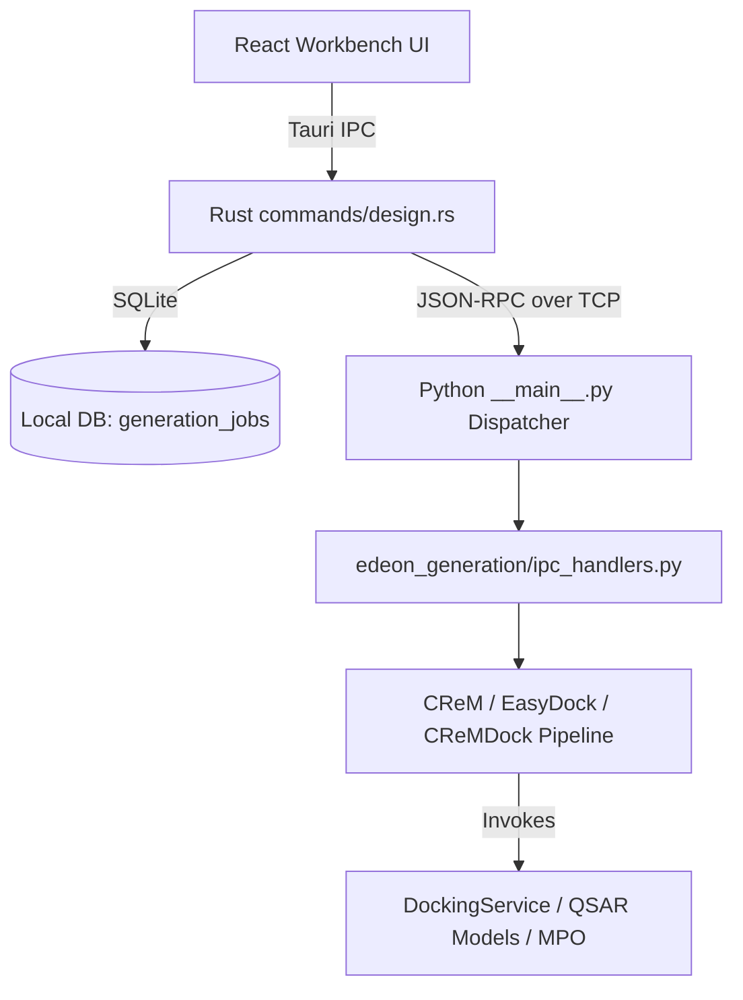

# CReM + EasyDock Developer Integration Notes

This document provides technical design notes and architectural details on the de novo pesticide design environment integrated into Edeon.

---

## 1. Architectural Flow

The de novo design framework connects the React/TypeScript frontend to a Rust-based Tauri backend, which interfaces with a Python computation service via a JSON-RPC IPC socket.



---

## 2. Python Components (`python/edeon_generation/`)

### A. CReM Mutation Engine (`crem_engine.py`)
Wraps the core `crem` library. 
*   **Fallback Bootstrapping**: If the default fragments database `crem_fragments_v0.3.db` is missing, it dynamically compiles a tiny database utilizing predefined benzene/anisole seed SMILES, invoking `crem.scripts.cremdb_create`.
*   **Database naming constraints**: Avoids SQLite keyword collision (e.g. `default`) by naming the generated fragments set as `standard`.

### B. EasyDock Service Wrapper (`easydock_wrapper.py`)
Provides batch docking automation.
*   **Concurrency**: Uses `asyncio.Semaphore` (capped at CPU cores count) to prepare ligand conformers and run Vina docking jobs in parallel.
*   **Simulation Fallback**: Leverages Edeon's core `DockingService` which automatically falls back to simulated/mocked docking scores if physical Vina/Gnina binaries are absent.

### C. Closed-Loop Evolutionary Pipeline (`crem_dock.py`)
Iterates through evolutionary cycles:
1.  Invokes `CReMGenerationEngine` to mutate seeds.
2.  Batch-docks unique mutants using `EasyDockService`.
3.  Calculates Tier-1 QSAR properties by executing the model prediction commands.
4.  Scores compounds using `compute_mpo_score` (combining docking affinity and safety profiles).
5.  Sorts candidates using:
    $$\text{Composite Score} = \text{MPO Score} - 1.2 \times \text{Docking Score}$$
    *(Since docking score is negative (e.g. -8.5), subtracting it increases the composite score)*.
6.  Selects the top `keep_top_n` compounds to seed the next generation.

---

## 3. Rust Tauri Layer & SQLite Persistence

### A. SQLite Table Schema
The jobs are persisted in SQLite. Migration 13 registers the table:

```sql
CREATE TABLE generation_jobs (
    job_id TEXT PRIMARY KEY,
    name TEXT NOT NULL,
    mode TEXT NOT NULL,
    parent_smiles TEXT,
    receptor_id TEXT,
    receptor_display_name TEXT,
    parameters_json TEXT NOT NULL,
    results_json TEXT NOT NULL,
    total_generated INTEGER NOT NULL,
    total_docked INTEGER NOT NULL,
    elapsed_seconds REAL NOT NULL,
    completed_at TEXT NOT NULL
);
```

### B. Tauri Commands (`src-tauri/src/commands/design.rs`)
*   `crem_generate`: Invokes the Python mutator.
*   `easydock_dock`: Invokes the batch virtual screen and inserts the job record into `generation_jobs`.
*   `crem_dock_run`: Runs the closed-loop pipeline and inserts the results.
*   `generation_history_list`, `generation_history_load`, `generation_history_delete`: Manage the SQLite database storage logs for past runs.

---

## 4. Progress Streaming Protocols

To prevent timeouts and keep the UI responsive during long-running docking batches, the Python pipeline periodically prints formatted progress logs:
`[DOCKING_PROGRESS] {"percent": <0-100>}`

The Rust engine capture-handler parses this stream, emitting `docking://progress` Tauri events to the frontend in real time, updating the UI loader bar.
