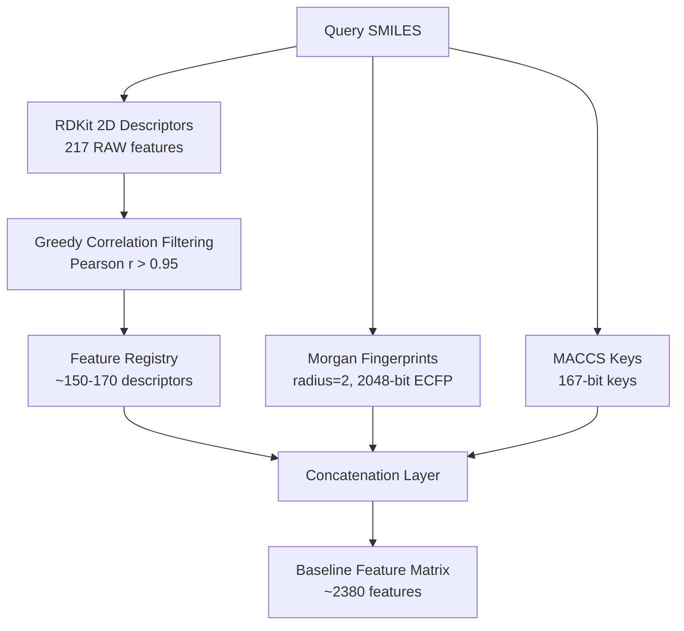

# Edeon Phase 2 — Tier-1 Reference Models Validation Protocol

This document outlines the validation and training protocol implemented for Edeon Phase 2 reference QSAR models. It serves as the formal methods specification for downstream publications (Paper 3).

---

## 1. Featurization Architecture

To capture multi-scale chemical properties, we employ a concatenated hybrid featurization scheme for all baseline models:



### A. Component Representations
1. **RDKit 2D Descriptors**: 217 2D descriptors representing physical chemistry properties (logP, molecular weight, charge, polar surface area).
2. **Morgan Fingerprints (ECFP4)**: 2048-bit binary topological fingerprints (radius=2) capturing local atomic environments.
3. **MACCS Keys**: 167-bit dictionary-based keys representing predefined structural keys.

### B. Dynamic Feature Reduction
To mitigate multicollinearity and the curse of dimensionality for baseline models, we apply a greedy correlation filter on the training partition:
* Descriptors with variance $< 10^{-6}$ are removed.
* Pairwise Pearson correlation coefficients are computed. If $|r| > 0.95$ between two descriptors, the descriptor appearing later alphabetically is pruned.
* Feature mappings and filtered descriptor names are saved to a serialized `feature_registry.json` to guarantee exact reconstruction at inference time.

---

## 2. Hyperparameter Optimization (HPO)

We use **Optuna** to perform hyperparameter optimization over the training partition using a custom scaffold-based cross-validator.

> [!IMPORTANT]
> **Scaffold-Stratified Splitting**:
> To ensure robust generalization testing under real-world domain shifts, all splits (train, calibration, test) and cross-validation folds are divided based on Bemis-Murcko molecular scaffolds.
> This ensures that no compound belonging to a training scaffold is ever evaluated in validation or test splits, representing a challenging out-of-distribution benchmark.

### HPO Search Space Configurations

| Model Type | Hyperparameter | Search Space Range / Choices |
|---|---|---|
| **Random Forest** | `n_estimators` | 100 – 500 (integer) |
| | `max_depth` | 5 – 30 (integer) |
| | `min_samples_leaf` | 1 – 10 (integer) |
| | `min_samples_split` | 2 – 20 (integer) |
| | `max_features` | `["sqrt", "log2", 0.3, 0.5]` |
| **XGBoost** | `n_estimators` | 100 – 1000 (integer) |
| | `max_depth` | 3 – 12 (integer) |
| | `learning_rate` | 0.01 – 0.3 (log scale) |
| | `reg_alpha` | $10^{-8}$ – 10.0 (log scale) |
| | `reg_lambda` | $10^{-8}$ – 10.0 (log scale) |
| | `subsample` | 0.6 – 1.0 (float) |
| | `colsample_bytree` | 0.6 – 1.0 (float) |
| **Chemprop** | `depth` | 2 – 5 (integer message passing layers) |
| | `hidden_size` | `[150, 300, 500]` |
| | `ffn_num_layers`| 1 – 3 (integer) |
| | `dropout` | 0.0 – 0.3 (float) |

---

## 3. Chemprop Ensemble Protocol

We integrate **Chemprop v2.2.3** utilizing PyTorch Lightning for Directed Message Passing Neural Network (D-MPNN) model training:

1. **5-Seed Ensemble**: Five separate D-MPNN models are trained using randomized seeds (`[0, 1, 2, 3, 4]`).
2. **Early Stopping**: The calibration partition is used as the early-stopping validation set to prevent overfitting during PyTorch Lightning training loops.
3. **Variance Tracking**: Standard deviation across the 5 seed model predictions is computed as a proxy for epistemic model uncertainty.

---

## 4. Conformal Calibration & Uncertainty Quantification

To guarantee statistically rigorous confidence intervals, we apply **inductive split conformal regression**:

### A. Uniform Conformal Regressor
Predicts a constant margin around prediction $y$:
$$\hat{C}(x) = [ \hat{\mu}(x) - q, \hat{\mu}(x) + q ]$$
where $q$ is the $(1-\alpha)(1 + 1/n)$-quantile of calibration absolute residuals $|y_i - \hat{\mu}(x_i)|$.

### B. Ensemble-Variance-Scaled Regressor
Scales the prediction interval dynamically using the Chemprop ensemble prediction standard deviation $\hat{\sigma}(x)$ (representing locally higher uncertainty):
$$\hat{C}(x) = [ \hat{\mu}(x) - q \cdot \hat{\sigma}(x), \hat{\mu}(x) + q \cdot \hat{\sigma}(x) ]$$
where $q$ is the $(1-\alpha)$-quantile of normalized residuals $\frac{|y_i - \hat{\mu}(x_i)|}{\hat{\sigma}(x_i)}$.

---

## 5. Applicability Domain (AD)

To prevent predictions outside our chemical space, we enforce a Tanimoto-based applicability domain:
* **Morgan Fingerprints**: 2048-bit (radius=2) fingerprints are generated for all training compounds.
* **Tanimoto 5-NN Distance**: For a new molecule, we find its Tanimoto distance to the 5 nearest neighbors in the training set.
* **Calibrated Thresholds**:
  * **In-Domain**: Distance $\le$ 95th percentile of training-set internal distances.
  * **Borderline**: Distance $\le$ 99th percentile of training-set internal distances.
  * **Out-of-Domain**: Distance $>$ 99th percentile of training-set internal distances.

---

## 6. Test Set Protection Gate

To enforce strict, non-contaminated evaluations (Hard Rule 1), all loading of test splits is gated through `TestSetGate`:

```python
# python/edeon_train/gates.py
class TestSetGate:
    # Counter-gated class guarding final evaluation splits
```

> [!WARNING]
> Test split loading raises a `RuntimeError` unless the gate is explicitly opened. The gate automatically locks upon loading, preventing secondary loads and guaranteeing a strictly single-shot test set evaluation.

---

## 7. Agrochemical Class Breakdown

To understand specific agrochemical performance, the evaluation report segments performance metrics across 12 SMARTS-based chemical classes:
1. *Organophosphates*
2. *Neonicotinoids*
3. *Strobilurins*
4. *SDHIs*
5. *Pyrethroids*
6. *Triazoles*
7. *Carbamates*
8. *Organochlorines*
9. *Organo-halogens*
10. *Macrocyclics*
11. *Phosphates*
12. *Synthetic Pyrethroids*
